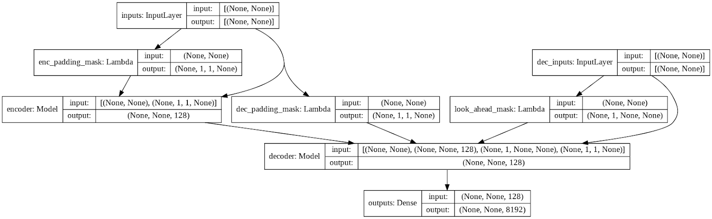
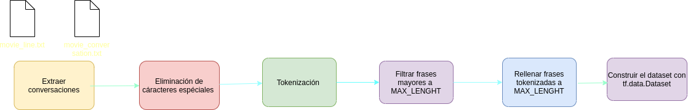
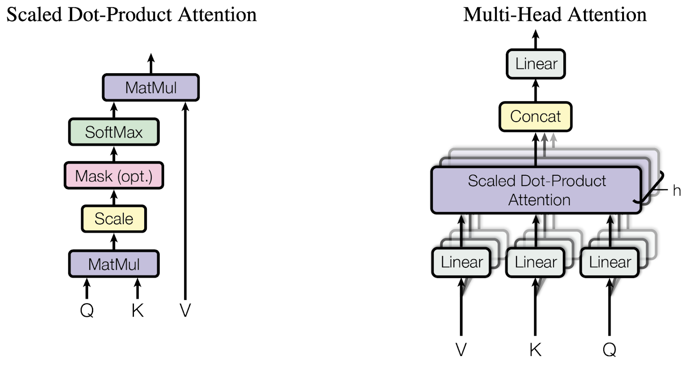
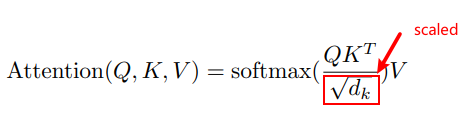
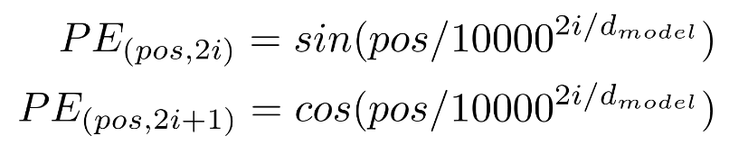
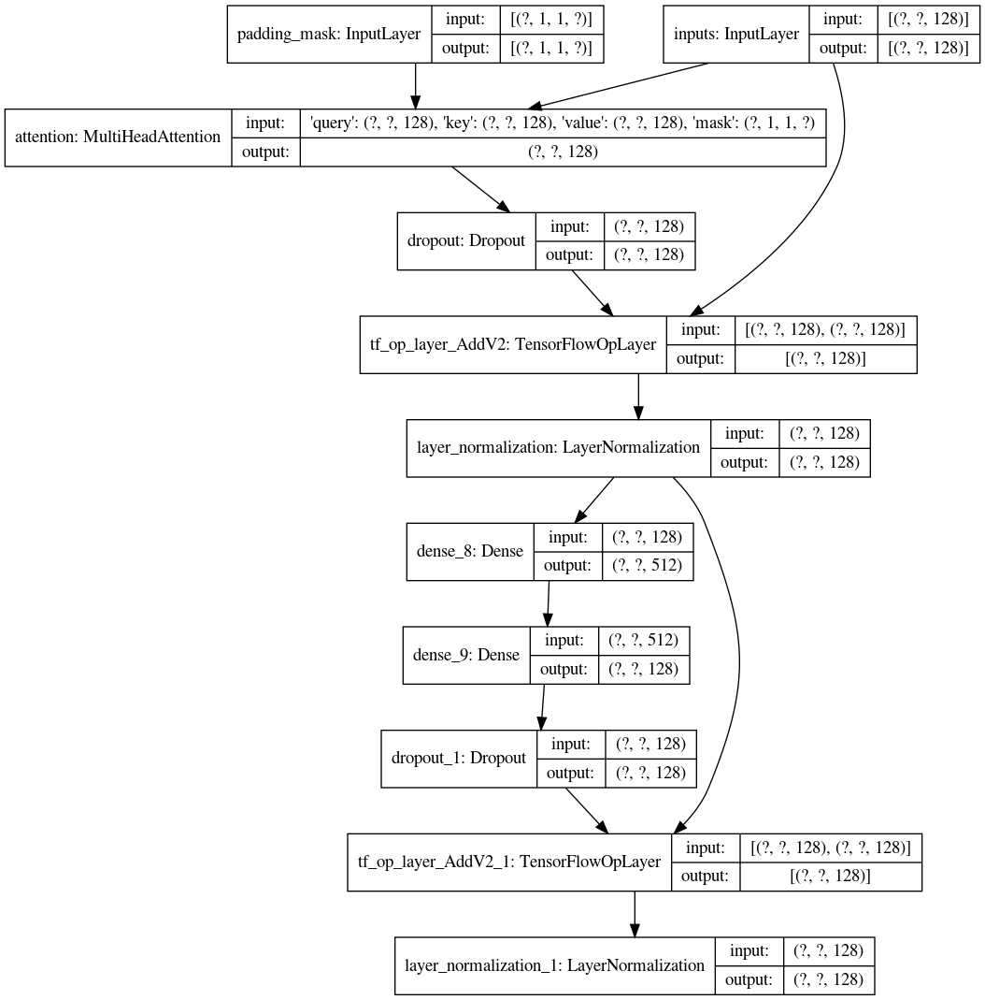

<h1>
    <b>
        <center>
            Tutorial de Chatbot Transformer con Tensorflow 2.0
        </center>
    </b>
</h1>

Artículo hecho por: [BryanM.Li](https://github.com/bryanlimy),[ FOR.ai](https://for.ai/).<br>
<h5>
Pueden ver el articulo en su idioma orginal <A href="https://blog.tensorflow.org/2019/05/transformer-chatbot-tutorial-with-tensorflow-2.html">aquí</A><br>
</h5>

<p>
    El uso de las Redes Neuronales Artificiales para la creación de chatbot a tenido una creciente popularidad hoy en dia, sin embargo, enseñarle a una computadora ha realizar un conversación natural  es relamente dificil y a menudo requiere de grandes y complicados modelos del lenguaje.<br>
    Con todos los cambios y mejoras hechas en Tensorflow 2.0, nosotros, podemos crear complicados modelos fácilmente.<br>
    En este post, Vamos a construir un chatbot utilizando la arquitectura transformer.<br>
    Este artículo asume cierto conocimiento de <A href="https://www.tensorflow.org/text/tutorials/text_generation">generación de texto</A>, <A href="https://www.tensorflow.org/text/tutorials/nmt_with_attention">atención</A> y <A href="https://www.tensorflow.org/text/tutorials/transformer">transformer</A>. En este tutorial nos vamos a enfocar sobre:  
    <ol type=”A”>
        <li>Procesamiento de <b>The Cornel Movie-Dialogs</b> usando <b>Tensorflow Datasets</b> y creando un pipeline de entrada usando <b>tf.data</b>.</li>
        <li>Implementación de <b>MultiHeadAttention</b> con subclases.</li>
        <li>Implementación de un Transformer con API funcional.</li>
    </ol>
</p> 

```
input: where have you been ?
output: i m not talking about that .
input: i am not crazy , my mother had me tested .
output: i m not sure . i m not hungry .
input: i m not sure . i m not hungry .
output: you re a liar .
input: you re a liar .
output: i m not going to be a man . i m gonna need to go to school .
```
Ejemplos de conversaciones con el chatbot entrenado sobre el dataset de <b>The Cornel Movie-Dialogs</b>. 

<h2>
    <b>
        Transformer
    </b>
</h2>

<p>
Transformer, fue propuesta en el paper <A href="https://arxiv.org/abs/1706.03762">Attention is All You Need</A>, es una arquitectura de red neuronal basada únicamente en los mecanismos de auto atención y son muy paralelizables.



Los transformer trabajan con entradas de tamaño variables usando stacks de capas de auto atención en lugar de RNN o CNN. Esta arquitectura tiene una serie de ventajas.
    <ol type=”A”>
        <li>No hace suposiciones sobre las relaciones temporales / espaciales entre los datos. Esto es ideal para procesar un conjunto de objetos.</li>
        <li>Los elementos distantes pueden afectar la salida de los demás sin pasar por muchos pasos recurrentes, o de capas de convolución.</li>
        <li>Las capas de salida pueden ser calculadas en paralelo, en lugar de una de serie como loa <b>RNN</b>.</li>
        <li>Puede aprender dependencias de largo alcance.</li>
    </ol>
Las desventajas de esta arquitectura:
    <ol type=”A”>
        <li>Para una serie de tiempo, la salida para un intervalo de tiempo se calcula a partir de todo el historial en lugar de solo las entradas y el estado oculto actual. Esto puede resultar menos eficaz.</li>
        <li>Si la entrada tiene una relación temporal / espacial, como el texto, se debe agregar alguna codificación posicional o el modelo verá efectivamente un <b>bag of word</b>.
        </li>   
    </ol>
</p>

Si estas interesado en conocer más acerca los transformer, revista [The Annoted Transformer](http://nlp.seas.harvard.edu/2018/04/03/attention.html#conclusion) y [The Illustrated Transformer](http://jalammar.github.io/illustrated-transformer/).

<h2>
    <b>
        Dataset
    </b>
</h2> 

Nosotros usamos <b>The Cornel Movie-Dialogs</b> como nuestro dataset, que contiene más de 220K conversaciones entre mas de 10k personajes de peliculas.

```+++$+++``` Se utilizó como un separador en todos los archivos dentro del conjunto de datos.

```movie_conversations.txt``` tiene el siguiente formato: ID del primer personaje, ID del segundo personaje, ID de la película en la que ocurre la conversación, y una lista de ID de línea. La información sobre personajes y películas se puede encontrar en ```movie_characters_metadata.txt``` y ```movie_titles_metadata.txt``` respectivamente.

```
u0 +++$+++ u2 +++$+++ m0 +++$+++ [‘L194’, ‘L195’, ‘L196’, ‘L197’]
u0 +++$+++ u2 +++$+++ m0 +++$+++ [‘L198’, ‘L199’]
u0 +++$+++ u2 +++$+++ m0 +++$+++ [‘L200’, ‘L201’, ‘L202’, ‘L203’]
u0 +++$+++ u2 +++$+++ m0 +++$+++ [‘L204’, ‘L205’, ‘L206’]
u0 +++$+++ u2 +++$+++ m0 +++$+++ [‘L207’, ‘L208’]
```
Ejemplos del texto de conversacion de ```movie_conversations.txt``` 

```movie_lines.txt``` tienen el siguiente formato: ID de linea de conversación,ID del personaje quien dice la frase, ID de la película,nombre del personaje y linea de texto.

```
L901 +++$+++ u5 +++$+++ m0 +++$+++ KAT +++$+++ He said everyone was doing it. So I did it.
L900 +++$+++ u0 +++$+++ m0 +++$+++ BIANCA +++$+++ As in…
L899 +++$+++ u5 +++$+++ m0 +++$+++ KAT +++$+++ Now I do. Back then, was a different story.
L898 +++$+++ u0 +++$+++ m0 +++$+++ BIANCA +++$+++ But you hate Joey
L897 +++$+++ u5 +++$+++ m0 +++$+++ KAT +++$+++ He was, like, a total babe
```
Ejemplos del texto de conversación de ```movie_lines.txt```. Nosotros vamos a contruir una pipeline de  entrada  con los siguientes pasos.
<!--
    <ol type=”A”>
        <li>Extraer una lista de pares de conversaciones de ```move_conversations.txt``` y ```movie_lines.txt```.</li>
        <li>Preprocesado eliminando caracteres especiales en cada oración.</li> 
        <li>Construir Tokenizar(mapear texto para ID e ID para texto.)</li>   
        <li>Tokenizar cada oración y añadir START_TOKEN y END_TOKEN para indicar inicio y fin de la oración.</li>
        <li>Filtra las oraciones que contienen más de MAX_LENGTH tokens.</li>
        <li>Rellenar frases tokenizadas a MAX_LENGTH</li>
        <li>Construye tf.data.Dataset con todas las frases tokenizadas.</li>
    </ol>
-->


Puedes ver el código del preprocesado [aqui](Chatbot/Chatbot.ipynb)
```
i really , really , really wanna go , but i can t . not unless my sister goes .
i m workin on it . but she doesn t seem to be goin for him .
```
Ejemplo del preprocesado

<h2> <b>Attention</b> </h2>

Como muchos modelos <b>sequence-to-sequence</b>, Transformer consiste en un encoder y decorder.
Sin embargo, en lugar de usar redes convolucionales o recurrentes, Transformer usa capas de <b>multi-head attention</b>, que consiten en multiples productos escaleres  a escala múltiple.


<h5><center>Diagrama de arquitectura de atención de <b>All You Need</b><center></h5>

<h2>Scaled dot product attention</h2>
La función <b>Scaled dot product</b> toma tres entradas: Q(query), K(key), V(value).La ecuación usada para caluclar los pesos de atención es:

<center>


[Introduction to Scaled Dot-Product Attention in Deep Learning – Deep Learning Tutorial](https://www.tutorialexample.com/an-introduction-to-scaled-dot-product-attention-in-deep-learning-deep-learning-tutorial/) 


[Introduction to Attention Mechanism](https://erdem.pl/2021/05/introduction-to-attention-mechanism)
</center>

A medida que se aplica laa normalización sobre ```key```, sus valores deciden la importancia que se le dara a ```query```. La salida representa la multiplicacion de los pesos de atención y ```value```. Esto asegura las palabras que queremos enfocarnos se mantengan como estan y las palabras irrelevantes se eliminan.

```
def scaled_dot_product_attention(query, key, value, mask):
  matmul_qk = tf.matmul(query, key, transpose_b=True)

  depth = tf.cast(tf.shape(key)[-1], tf.float32)
  logits = matmul_qk / tf.math.sqrt(depth)

  # add the mask zero out padding tokens.
  if mask is not None:
    logits += (mask * -1e9)

  attention_weights = tf.nn.softmax(logits, axis=-1)

  return tf.matmul(attention_weights, value)
  ```

<h2>Multi-head Attetion layer</h2>

<b>Sequential model</b> nos permite corstruir modelos rapidamente  y facilmente apilando capas una encima de la otra; sin embargo, para más complicados y <b>non-sequential models</b>, la <b>Functional API</b> y <b>Model sublcassing</b> son necesarios. ```tf.keras```  nos permitira combinar y mezclar diferentes estilos. Mi favorita caracterisitca de <b>Model subclassing</b> es la capacidad de <b>debugging</b>.Puedo establecer un <b>breakpoint</b> en el
método ```call()``` y observa los valores por cada capa  de entradas y salidas como numpy array, y esto hace que el <b>debugging</b> sea mucho más sencilla.

Aquí, Nosotros usaremos ```Model sublcassing``` para implementar nuestras capas de ```MultiHeadAttention```.

```MultiHeadAttention```consiste en 4 partes:
<ol type=”A”>
    <li>Capas lineales  y <b>split</b> en <b>heads</b>.</li>
    <li>Scaled dot-product attention.</li>
    <li>Concatenación de <b>heads</b>.</li>
    <li>Capas finales.</li>
</ol>

<center>

</center>

<center>
<A href="https://data-science-blog.com/blog/2021/04/07/multi-head-attention-mechanism/">Multi-head attention mechanism: “queries”, “keys”, and “values,” over and over again</A>
</center>

Cada bloque de mulit-head attention toma un diccionario como input, el cual consiste en un 
```query``` , ```key```, ```value```. Nota que cuando usamos un <b>Modeling subclassing</b> con Functional API, las entradas deben mantenerse como un solo argumento, por lo tanto, tenemos que envolver la consulta, la clave y el valor como un diccionario.
Luego las entradas se pasan por las capas densas y se divide en varios``` heads```.
```scaled_dot_product_attention()``` definido anteriormente se aplica a cada cabeza. Una apropiada mascara debe ser usada para los pasos de atención. La atención de salida para cada heads is entonces es concatenada y puesta atravez de una capa densa final.

En lugar de un solo ```attention head```, query, key, and value son divididos en multipleas ```heads``` porque permite que el modelo atienda de manera conjunta la información en diferentes posiciones de diferentes espacios de representación. Después de la división, cada cabezal tiene una dimensionalidad reducida, por lo que el costo total de cálculo es el mismo que el de una atención de un solo cabezal con dimensionalidad completa.

```
class MultiHeadAttention(tf.keras.layers.Layer):

  def __init__(self, d_model, num_heads, name="multi_head_attention"):
    super(MultiHeadAttention, self).__init__(name=name)
    self.num_heads = num_heads
    self.d_model = d_model

    assert d_model % self.num_heads == 0

    self.depth = d_model // self.num_heads

    self.query_dense = tf.keras.layers.Dense(units=d_model)
    self.key_dense = tf.keras.layers.Dense(units=d_model)
    self.value_dense = tf.keras.layers.Dense(units=d_model)

    self.dense = tf.keras.layers.Dense(units=d_model)

  def split_heads(self, inputs, batch_size):
    inputs = tf.reshape(
        inputs, shape=(batch_size, -1, self.num_heads, self.depth))
    return tf.transpose(inputs, perm=[0, 2, 1, 3])

  def call(self, inputs):
    query, key, value, mask = inputs['query'], inputs['key'], inputs[
        'value'], inputs['mask']
    batch_size = tf.shape(query)[0]

    # linear layers
    query = self.query_dense(query)
    key = self.key_dense(key)
    value = self.value_dense(value)

    # split heads
    query = self.split_heads(query, batch_size)
    key = self.split_heads(key, batch_size)
    value = self.split_heads(value, batch_size)

    scaled_attention = scaled_dot_product_attention(query, key, value, mask)

    scaled_attention = tf.transpose(scaled_attention, perm=[0, 2, 1, 3])

    concat_attention = tf.reshape(scaled_attention,
                                  (batch_size, -1, self.d_model))

    outputs = self.dense(concat_attention)

    return outputs
```
<h5><center>Implementación de las capas MultiHeadAttention con Model sublcassing</center></h5>
<h2><b>Transformer</b></h2>

<center></center>
<h5>
    <center>
            Diagrama de la arquitectura transformer, imágen extraída del paper "Attention is All You Need."
    </center>
</h5>

Transformer usan un stack de multi-head attention y capas densas tanto para el encoder y decoder. El encoder asigna una secuencia de entradas de representaciones de símbolos a una sencuencia de representaciones continuas.Luego, el decodificador toma las represantaciones continuas y genera una secuencia de sálida de símbolos, un elemento a la vez.

<h2><b>Positional encoding</b></h2>
Debido a que los Transfomer no trabajan ninguna recurrencia o convolución, se le añado el <b>postional encoding</b> para darle al modelo información de la posición relativa  de las palabras  en la frase.


<center><h5>Formula para calcular los positional encoding</h5></center>
<br>
El positional encoding vector es añadido a un embedding vector. Embeddings representa un token en una espacio d-dimensional donde los token con similar meanining van a estar más cerca uno del otro. Pero los embedding no codifican las posiciones relativas de las palabras en las frases. Despues de añadir los positional encoding, las palabras van a estar más cerca en función a la similitud de su significado y su posición en la frase, en el espacio d-dimensional.

Nosotros implementamos  los positional encoding con Model sublcassing donde aplicamos el encoding matrix para la entrada ```call()```.

```
class PositionalEncoding(tf.keras.layers.Layer):

  def __init__(self, position, d_model):
    super(PositionalEncoding, self).__init__()
    self.pos_encoding = self.positional_encoding(position, d_model)

  def get_angles(self, position, i, d_model):
    angles = 1 / tf.pow(10000, (2 * (i // 2)) / tf.cast(d_model, tf.float32))
    return position * angles

  def positional_encoding(self, position, d_model):
    angle_rads = self.get_angles(
        position=tf.range(position, dtype=tf.float32)[:, tf.newaxis],
        i=tf.range(d_model, dtype=tf.float32)[tf.newaxis, :],
        d_model=d_model)
    # apply sin to even index in the array
    sines = tf.math.sin(angle_rads[:, 0::2])
    # apply cos to odd index in the array
    cosines = tf.math.cos(angle_rads[:, 1::2])

    pos_encoding = tf.concat([sines, cosines], axis=-1)
    pos_encoding = pos_encoding[tf.newaxis, ...]
    return tf.cast(pos_encoding, tf.float32)

  def call(self, inputs):
    return inputs + self.pos_encoding[:, :tf.shape(inputs)[1], :]
```
<h2><b>Transformer con la API fuctional</b></h2>
Con la API funcional, Nosotros podemos apilar nuestras capas de manera similar a un   

```sequential model``` sin la restricción de que sea un sequential model, y sin declarar todas las variables y variables que necesitabamos por adelantado como Model subclassing. Una ventaja de la API funcional es que esta puede validar el modelo  a medida que los construimos, como chekeando los tamaños de entrada y salida  de cada capa, y generar un mensaje de error significativo cuando hay una discrepancia.

Nosotros implementamos nuestras capas encoding, encoder, capas decoding, decoder y el transformer usando la API functional.

puedes resivisar como implementamos el mismo modelo con Model subclassing en este [tutorial](https://www.tensorflow.org/text/tutorials/transformer).


<h2><b>Encoding Layer</b></h2>
Cada encoder consiste en 2 subcapas:
<ol type=”A”>
    <li>Multi-Head Attention con padding Mask</li>
    <li>2 capas densas seguido de un dropout</li>
</ol>

```
def encoder_layer(units, d_model, num_heads, dropout, name="encoder_layer"):
  inputs = tf.keras.Input(shape=(None, d_model), name="inputs")
  padding_mask = tf.keras.Input(shape=(1, 1, None), name="padding_mask")

  attention = MultiHeadAttention(
      d_model, num_heads, name="attention")({
          'query': inputs,
          'key': inputs,
          'value': inputs,
          'mask': padding_mask
      })
  attention = tf.keras.layers.Dropout(rate=dropout)(attention)
  attention = tf.keras.layers.LayerNormalization(
      epsilon=1e-6)(inputs + attention)

  outputs = tf.keras.layers.Dense(units=units, activation='relu')(attention)
  outputs = tf.keras.layers.Dense(units=d_model)(outputs)
  outputs = tf.keras.layers.Dropout(rate=dropout)(outputs)
  outputs = tf.keras.layers.LayerNormalization(
      epsilon=1e-6)(attention + outputs)

  return tf.keras.Model(
      inputs=[inputs, padding_mask], outputs=outputs, name=name)
```   
Pueden usar tf.keras.utils.plot_model() para visualizar nuestro modelo.
<center></center>
<center><h5>Diagrama de flujo del encoder layer</h5></center>

<h2><b>Encoder</b></h2>
El encoder consite en:
<ol type=”A”>
    <li>Input embedding</li>
    <li>Postional encoding</li>
    <li>N de la capa encoder</li>   
</ol>

El input se pasa atravez de un embeding para que se sume con la codificación posicional. La suma es la entrada a las capas del codificador. La salida del codificador es la entrada del 
decodificador.
```
def encoder(vocab_size,
            num_layers,
            units,
            d_model,
            num_heads,
            dropout,
            name="encoder"):
  inputs = tf.keras.Input(shape=(None,), name="inputs")
  padding_mask = tf.keras.Input(shape=(1, 1, None), name="padding_mask")

  embeddings = tf.keras.layers.Embedding(vocab_size, d_model)(inputs)
  embeddings *= tf.math.sqrt(tf.cast(d_model, tf.float32))
  embeddings = PositionalEncoding(vocab_size, d_model)(embeddings)

  outputs = tf.keras.layers.Dropout(rate=dropout)(embeddings)

  for i in range(num_layers):
    outputs = encoder_layer(
        units=units,
        d_model=d_model,
        num_heads=num_heads,
        dropout=dropout,
        name="encoder_layer_{}".format(i),
    )([outputs, padding_mask])

  return tf.keras.Model(
      inputs=[inputs, padding_mask], outputs=outputs, name=name)
```

<h5><center>implementación del encoder con la API funcional</center></h5>

<h2><b>Decoder Layer</b></h2>
Cada decoder layer consiste en subcapas.
<ol type=”A”>
    <li>Masked multi-head attention (Con ahead mask y padding mask)</li>
    <li>Multi-head attention(con padding mask).value y key recive el encoder output como
    inputs. Query recive el output de la subcapa masked multi-head attention </li>
    <li>2 capas densas seguidas por un dropout</li>
</ol>
El Query recive la salida del primer bloque de atención del decoder, y key recive la salida del encoder, los pesos de atención representan la importancia que le da la salida del decoder basado en la salida del encoder. En otras palabras, La predicción de la siguiente palabra del decoder mirando la salida de encoder y atendiendo a su propia salida.

```
def decoder_layer(units, d_model, num_heads, dropout, name="decoder_layer"):
  inputs = tf.keras.Input(shape=(None, d_model), name="inputs")
  enc_outputs = tf.keras.Input(shape=(None, d_model), name="encoder_outputs")
  look_ahead_mask = tf.keras.Input(
      shape=(1, None, None), name="look_ahead_mask")
  padding_mask = tf.keras.Input(shape=(1, 1, None), name='padding_mask')

  attention1 = MultiHeadAttention(
      d_model, num_heads, name="attention_1")(inputs={
          'query': inputs,
          'key': inputs,
          'value': inputs,
          'mask': look_ahead_mask
      })
  attention1 = tf.keras.layers.LayerNormalization(
      epsilon=1e-6)(attention1 + inputs)

  attention2 = MultiHeadAttention(
      d_model, num_heads, name="attention_2")(inputs={
          'query': attention1,
          'key': enc_outputs,
          'value': enc_outputs,
          'mask': padding_mask
      })
  attention2 = tf.keras.layers.Dropout(rate=dropout)(attention2)
  attention2 = tf.keras.layers.LayerNormalization(
      epsilon=1e-6)(attention2 + attention1)

  outputs = tf.keras.layers.Dense(units=units, activation='relu')(attention2)
  outputs = tf.keras.layers.Dense(units=d_model)(outputs)
  outputs = tf.keras.layers.Dropout(rate=dropout)(outputs)
  outputs = tf.keras.layers.LayerNormalization(
      epsilon=1e-6)(outputs + attention2)

  return tf.keras.Model(
      inputs=[inputs, enc_outputs, look_ahead_mask, padding_mask],
      outputs=outputs,
      name=name)
```
<h5><center>Implementación de la decoder layer con la API functional</center></h5>

<h2><b>Decoder</b></h2>
El decoder consiste de:
<ol type="A">
    <li>Output embedding</li>
    <li>postional encoding</li>
    <li>N decoders layers</li>
</ol>

El target  pasa a travez de un embedding que es sumado con el positional encodding. La salida de esta suma es la entrada del decoder layers. La salida del decoder es la entrada para la capa final.

```
def decoder(vocab_size,
            num_layers,
            units,
            d_model,
            num_heads,
            dropout,
            name='decoder'):
  inputs = tf.keras.Input(shape=(None,), name='inputs')
  enc_outputs = tf.keras.Input(shape=(None, d_model), name='encoder_outputs')
  look_ahead_mask = tf.keras.Input(
      shape=(1, None, None), name='look_ahead_mask')
  padding_mask = tf.keras.Input(shape=(1, 1, None), name='padding_mask')
  
  embeddings = tf.keras.layers.Embedding(vocab_size, d_model)(inputs)
  embeddings *= tf.math.sqrt(tf.cast(d_model, tf.float32))
  embeddings = PositionalEncoding(vocab_size, d_model)(embeddings)

  outputs = tf.keras.layers.Dropout(rate=dropout)(embeddings)

  for i in range(num_layers):
    outputs = decoder_layer(
        units=units,
        d_model=d_model,
        num_heads=num_heads,
        dropout=dropout,
        name='decoder_layer_{}'.format(i),
    )(inputs=[outputs, enc_outputs, look_ahead_mask, padding_mask])

  return tf.keras.Model(
      inputs=[inputs, enc_outputs, look_ahead_mask, padding_mask],
      outputs=outputs,
      name=name)
```

<h2><b>Transformer</b></h2>
Consiste en un encoder, decoder y una capa final. La salida del decoder es la entrada del la capa final y esta ultima es la salida retornada.

```enc_padding_mask``` y ```dec_padding_mask``` son usados para enmascarar todos los padding tokens.```look_ahead_mask``` es usado para enmascarar los futuros tokens en secuencia. Como la longitud de la mascara cambia con diferentes longidtudes de secuencias de entradas, nosotros creamos estas mascaras con lambda layers.

```
def transformer(vocab_size,
                num_layers,
                units,
                d_model,
                num_heads,
                dropout,
                name="transformer"):
  inputs = tf.keras.Input(shape=(None,), name="inputs")
  dec_inputs = tf.keras.Input(shape=(None,), name="dec_inputs")

  enc_padding_mask = tf.keras.layers.Lambda(
      create_padding_mask, output_shape=(1, 1, None),
      name='enc_padding_mask')(inputs)
  # mask the future tokens for decoder inputs at the 1st attention block
  look_ahead_mask = tf.keras.layers.Lambda(
      create_look_ahead_mask,
      output_shape=(1, None, None),
      name='look_ahead_mask')(dec_inputs)
  # mask the encoder outputs for the 2nd attention block
  dec_padding_mask = tf.keras.layers.Lambda(
      create_padding_mask, output_shape=(1, 1, None),
      name='dec_padding_mask')(inputs)

  enc_outputs = encoder(
      vocab_size=vocab_size,
      num_layers=num_layers,
      units=units,
      d_model=d_model,
      num_heads=num_heads,
      dropout=dropout,
  )(inputs=[inputs, enc_padding_mask])

  dec_outputs = decoder(
      vocab_size=vocab_size,
      num_layers=num_layers,
      units=units,
      d_model=d_model,
      num_heads=num_heads,
      dropout=dropout,
  )(inputs=[dec_inputs, enc_outputs, look_ahead_mask, dec_padding_mask])

  outputs = tf.keras.layers.Dense(units=vocab_size, name="outputs")(dec_outputs)

  return tf.keras.Model(inputs=[inputs, dec_inputs], outputs=outputs, name=name)
```

<h5><center>Implementación de transformer con la API functional</Center></h5>

```
NUM_LAYERS = 2
D_MODEL = 256
NUM_HEADS = 8
UNITS = 512
DROPOUT = 0.1

model = transformer(
    vocab_size=VOCAB_SIZE,
    num_layers=NUM_LAYERS,
    units=UNITS,
    d_model=D_MODEL,
    num_heads=NUM_HEADS,
    dropout=DROPOUT)
```

Despues definimos nuestra función de perdida, optimizer and métricas, nosotros podemos simplificar nuestro entrenamiento con ```model.fit()```. Notemos que tenemos que  enmáscarar nuestra función de perdida de modo que se ingoren los padding tokens.además debemos usar nuestro propio radio de aprendizaje.

```
def loss_function(y_true, y_pred):
  y_true = tf.reshape(y_true, shape=(-1, MAX_LENGTH - 1))
  
  loss = tf.keras.losses.SparseCategoricalCrossentropy(
      from_logits=True, reduction='none')(y_true, y_pred)

  mask = tf.cast(tf.not_equal(y_true, 0), tf.float32)
  loss = tf.multiply(loss, mask)

  return tf.reduce_mean(loss)

class CustomSchedule(tf.keras.optimizers.schedules.LearningRateSchedule):

  def __init__(self, d_model, warmup_steps=4000):
    super(CustomSchedule, self).__init__()

    self.d_model = d_model
    self.d_model = tf.cast(self.d_model, tf.float32)

    self.warmup_steps = warmup_steps

  def __call__(self, step):
    arg1 = tf.math.rsqrt(step)
    arg2 = step * (self.warmup_steps**-1.5)

    return tf.math.rsqrt(self.d_model) * tf.math.minimum(arg1, arg2)

learning_rate = CustomSchedule(D_MODEL)

optimizer = tf.keras.optimizers.Adam(
    learning_rate, beta_1=0.9, beta_2=0.98, epsilon=1e-9)

def accuracy(y_true, y_pred):
  # ensure labels have shape (batch_size, MAX_LENGTH - 1)
  y_true = tf.reshape(y_true, shape=(-1, MAX_LENGTH - 1))
  accuracy = tf.metrics.SparseCategoricalAccuracy()(y_true, y_pred)
  return accuracy

model.compile(optimizer=optimizer, loss=loss_function, metrics=[accuracy])

EPOCHS = 20

model.fit(dataset, epochs=EPOCHS)
```

<h2><b>Evaluation</b></h2>
Para evaluar, tenemos que ejecutar la inferencia un paso de tiempo a la vez y pasar la salida del paso de tiempo anterior como entrada.

Tenga encuenta que normamente no aplicamos el dropout al momento de la inferencia, pero nosotros no especificamos un argumento ```training``` en nuestro modelo. Esto porque ```training``` y ```mask``` ya estan integrados para ti, si nosotros queremos correr nuestro modelo en modo evaluación, simplemente llamamos al model(inputs, training=False) para correr el modelo en modo inferencia.

```
def evaluate(sentence):
  sentence = preprocess_sentence(sentence)

  sentence = tf.expand_dims(
      START_TOKEN + tokenizer.encode(sentence) + END_TOKEN, axis=0)

  output = tf.expand_dims(START_TOKEN, 0)

  for i in range(MAX_LENGTH):
    predictions = model(inputs=[sentence, output], training=False)

    # select the last word from the seq_len dimension
    predictions = predictions[:, -1:, :]
    predicted_id = tf.cast(tf.argmax(predictions, axis=-1), tf.int32)

    # return the result if the predicted_id is equal to the end token
    if tf.equal(predicted_id, END_TOKEN[0]):
      break

    # concatenated the predicted_id to the output which is given to the decoder as its input.
    output = tf.concat([output, predicted_id], axis=-1)

  return tf.squeeze(output, axis=0)

def predict(sentence):
  prediction = evaluate(sentence)
  predicted_sentence = tokenizer.decode([i for i in prediction if i < tokenizer.vocab_size])
  return predicted_sentence.
```
<h5><b>Implementación de la evalución del trasformer </b></h5>

Para el test, podemos llamar a ```predict(sentence)```

```
>>> output = predict(‘Where have you been?’)
>>> print(output)
i don t know . i m not sure . i m a paleontologist .
```
 
 <h2><b>Resumen</b></h2>
 Aquí nostros, Implementamos un transformer en Tensorflow 2.0 en alrededor 500 lineas de código.
 En este tutorial, nos enfocamos en dos diferentes enfoques para implementar modelos complejos como lo son la API funcional y Model subclassing, y como imcorporarlos.

Si queires saber más de acerca de stos dos encoques como sus pros y contras, revisa [when to use the functional API](https://www.tensorflow.org/guide/keras/functional#when_to_use_the_functional_api) guia de Tensorflow.

Intenta usando diferentes datasets or hiperparámetros para entrar Transformers!!gracias por leer.